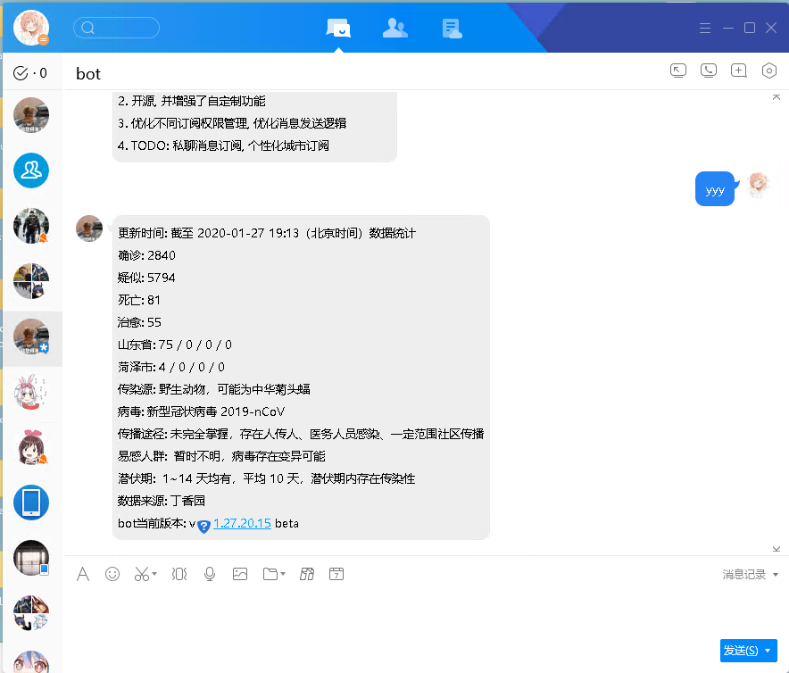
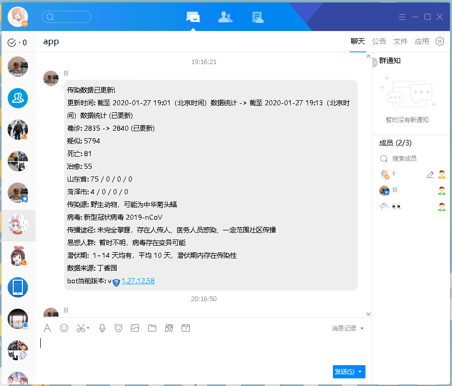

# 2019-nCoV QQbot

## 功能

1. 私聊(包括临时会话)发送任何消息, 回复当日疫情
2. 群里@bot, 回复当日疫情
3. 自动检测, 当数据更新进行提醒

如果不想自己构建, 可以加入QQ群 [361684286](https://jq.qq.com/?_wv=1027&k=5aVl6qu), 或者bot 1472745738. 后续将加上私聊更新订阅和个性化城市设置功能(如果咕了就算了)

效果如下:






## 环境

酷Q

golang + gcc

> tip: gcc 需要链接为32位程序, 因此请正确配置gcc

## 构建

```bash
cd src
cmd /c "build.cmd"
```

将生成的 app.dll 和 app.json 拷贝至 `酷Q根目录/dev/com.acdzh.dxy/`, 最后一级目录视你修改的包名而定

参考: [酷Q官方文档](https://docs.cqp.im/)

## 其他

感谢: [丁香园疫情通报平台](https://3g.dxy.cn/newh5/view/pneumonia), [酷Q](https://cqp.cc/), [@Tnze](https://github.com/Tnze/CoolQ-Golang-SDK), 以及所有奋战在"战疫"一线的工作者和所有为抗击疫情做过贡献的人们

